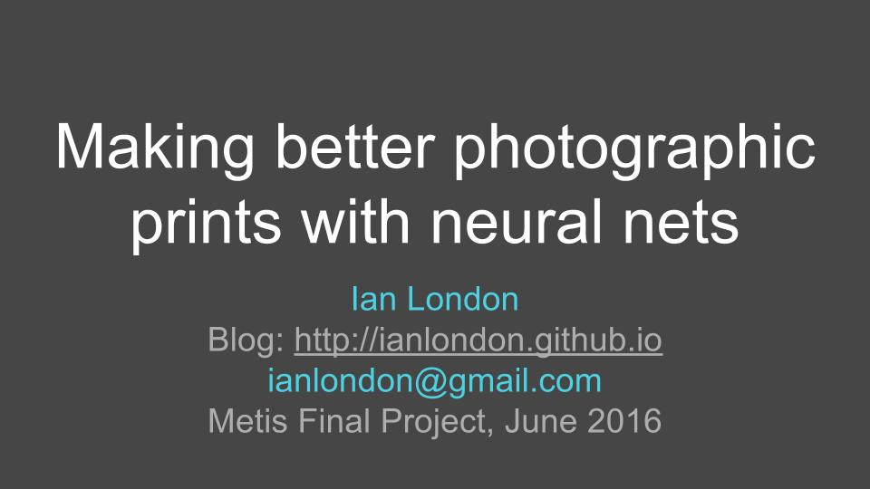
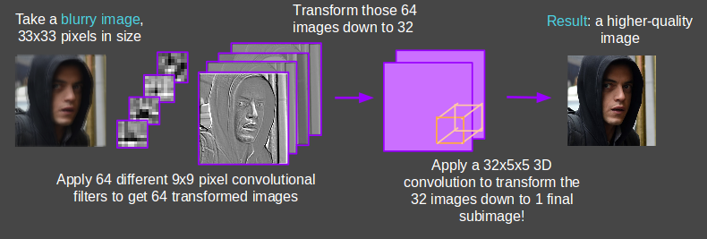
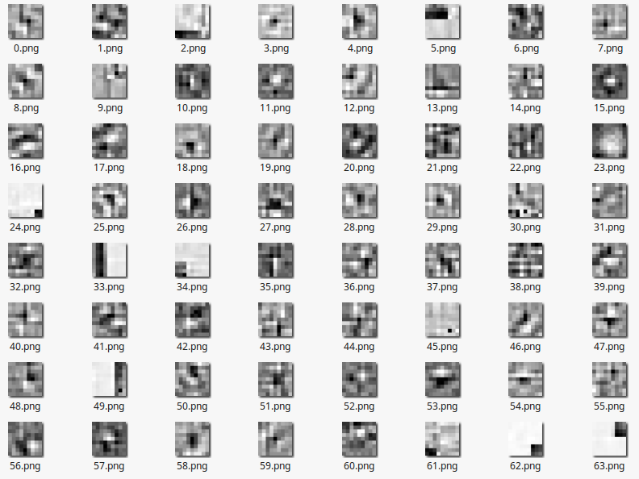

# Photo Superresolution:
## Improve resolution of photographs with neural nets

This project uses a convolutional neural network (CNN) to learn how to reverse some of the blur that you get when you scale images up in size. It can also learn to reverse other functions that manipulate images: for example, it can learn to approximately reverse a "sketch" filter.

The architecture of this CNN is based on the paper: [Dong, Chao, et al. `"Learning a deep convolutional network for image super-resolution."` *Computer Vision–ECCV 2014.* Springer International Publishing, 2014. 184-199.](https://arxiv.org/pdf/1501.00092.pdf)

[Keras](http://keras.io/) is used to create and train the CNN. It can be run on top of either Tensorflow or Theano. Training the un-blur model takes under 14 hours on a training set of 5,000 subimages

### Presentation Slide Deck
Slides from my lightning talk at Metis are available [here
](https://docs.google.com/presentation/d/1_2clNzrl-rtgsJKQrMbCsv028NwNqaHB0-dSN-rDwE0/edit?usp=sharing)

### CNN Architecture


## Installation and use

### 0. Install dependencies
This project requires that **Keras** is configured (which also requires Tensorflow or Theano), see [the official site](http://keras.io) for instructions.

This project also requires **OpenCV 3**, which can be painful to install. I recommend installing [Anaconda python](https://www.continuum.io/downloads) and then doing the following:

``` bash
conda create -n superresolution numpy scipy scikit-learn flickrapi python=2.7
source activate superresolution
conda install -c https://conda.binstar.org/menpo opencv3
```

Finally, create a file called `secrets.py` with your flickr API information, used for the image scraping in `downloader.py`:

#### secrets.py
``` python
KEY = 'asdfghjkl345BlahBlahBlah'
SECRET = 'qweertyuiop123BlahBlahBlah
```

### 1. Configuration
First, set up your configuration in `config.py`. The most important things you will have to change is the directory names (ending in `_DIR`). Make these directories if they do not already exist, otherwise you'll get an error.

### 2. Obtaining training images
The neural net needs clean images to train on. Download natural images from flickr with `downloader.py`:

1. First obtain URLs of (by default, they will be saved to
`flickr_face_urls.txt`)

    ``` bash
    python downloader.py --save_urls --tags['face','portrait','people']
    ```

1. Then download the images and generate 33x33 pixel subimages (aka patches). The CNN requires input of fixed size, so it works on one 33x33 pixel subimage at a time.

    ``` bash
    python downloader.py --download --gen_patches
    ```

### 3. Training
Run `train_convnet.py` to load up the image patches for the selected mode for a given number of epochs and a given batch size (all of this is specified in `config.py`). On an Amazon AWC EC2 `g2.2xlarge` instance, it takes 14 hours to converge but decent results can be obtained in around 6 hours or so.

At then end of each epoch, the weights will be saved in `.h5` format, so that you can resume from any point.

### 4. Deblurring images
Finally with the training done, run

``` bash
python process_img.py --input path/to/input_img.png --output path/to/output_img.png
```

Try `python process_img.py --help` for more options.

### 5. (Just for fun) Visualize the filters learned in the first layer

Assuming your model is named "convnet00", run `python visualize_filters.py`. This will generate 64 images corresponding to the convolutional filters learned in the first layer of the neural net. It will also apply the filters I found there are edge detectors, a gaussian blur (#23), translation operations (eg #62 and #63), and other interesting stuff.



## Other Modes
* The **"deblur"** mode is used to reverse the blurring that occurs when images are upscaled with bicubic interpolation.
* In addition to the "deblur" mode, there is a **"sketch"** mode which converts line drawings to greyscale renderings. Specify its use in `config.py`.
